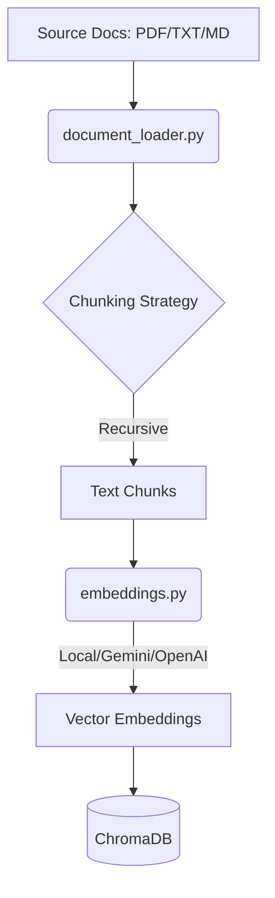
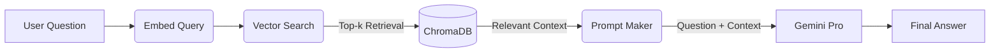

# RAG System: Architecture & Deployment

This document provides a technical overview of the current Retrieval-Augmented Generation (RAG) system and the roadmap for its future deployment.

---

## 🏗️ System Architecture

The RAG system is divided into two primary phases: **Indexing (Training)** and **Inference (Querying)**.

### 1. Indexing Pipeline (The "Training" Phase)
In RAG, "training" refers to the process of ingestion and vectorization of domain-specific data.

- **Loaders**: `DocumentLoader` handles PDF (via PyPDF2), TXT, and MD files.
- **Chunking**: Uses a default size of 500 characters with 100-character overlap to preserve context across boundaries.
- **Vectorization**: Transforms text into high-dimensional vectors. Supported backends include:
  - **Local**: `intfloat/multilingual-e5-small` (E5) or `all-MiniLM-L6-v2`.
  - **Cloud**: Google Gemini (`text-embedding-004`) or OpenAI.
- **Storage**: Components are stored in **ChromaDB**, which manages the vector index and metadata.

### 2. Inference Pipeline (Retrieval & Generation)
Inference happens when a user asks a question.

- **Retrieval**: The query is embedded using the same model from the Indexing phase. ChromaDB performs a similarity search (Euclidean distance) to find the most relevant chunks.
- **Augmentation**: The system concatenates the top-k chunks into a structured context block.
- **Generation**: The prompt (Context + Question) is sent to the LLM (Gemini) to generate a grounded, objective response.

---

## 🚀 Future Deployment Strategy

To transition from a local development script to a production-ready service, the following deployment roadmap is proposed:

### 1. Containerization (Docker)
Package the application as a stateless container using a `Dockerfile`.
- **Base Image**: Python 3.11-slim.
- **Volumes**: Mount a persistent storage path for ChromaDB or use an external vector database.

### 2. Google Cloud Run (Serverless)
Deploy the inference endpoint as a Cloud Run service for high scalability and low cost.
- **Memory**: 1GB-2GB (enough to load local embedding models if not using API-based ones).
- **Concurrency**: Set to handle multiple simultaneous user queries.

### 3. Data Storage & Automation
- **GCS Bucket**: Store the raw source PDF/TXT files in a Google Cloud Storage bucket.
- **Cloud Pub/Sub + Cloud Functions**: Automatically trigger the **Indexing Pipeline** whenever a new document is uploaded to the bucket.
- **Cloud Build (CI/CD)**: Automate deployments and testing when pushing to the main branch.

### 4. Managed Vector Database (Scaling)
As the document count grows (10k+ documents), migrate from local ChromaDB to a managed service:
- **Vertex AI Search (Vector Search)**: For high-scale, low-latency similarity searches.
- **Pinecone / Weaviate**: Specialized managed vector stores.

---

> [!TIP]
> **Current Default Backend**: The system currently defaults to using Gemini for both embeddings and generation when the `GEMINI_API_KEY` is provided. This provides the highest accuracy but requires internet connectivity.
